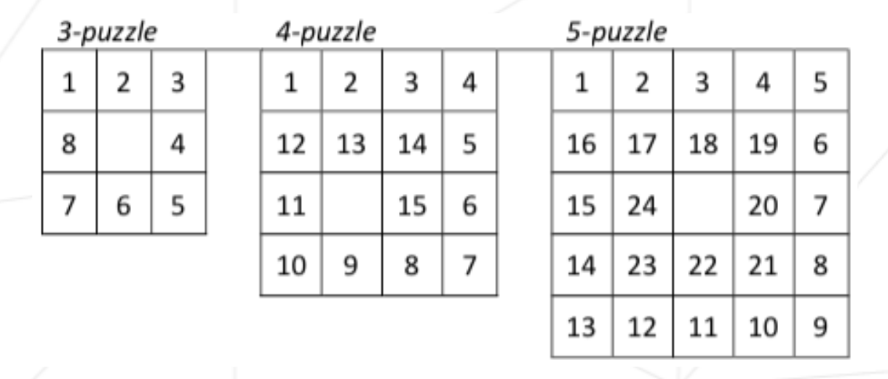

# N-Puzzle


N-Puzzle Solver

```
usage:	npuzzle [-c -g -H -L -M -C -s] [file_name]
	-c: color output
	-g: greedy algo
	-M: Heuristic: Manhattan
	-H: Heuristic: Hamming + Manhattan (Default)
	-L: Heuristic: Linear conflict + Manhattan
	-D: Djikstra
	-E: Euclidean
	-C: Chebyshev
	-s: sleep to print output
```

snail resolution:



Puzzle Exemple
```
$ » cat Puzzle_Solvable_3
# Comment
3
6 7 3
# an other Comment
1 0 4
8 2 5

$ » cat Puzzle_Solvable_4
# This puzzle is solvable
4
 9 11  8  0
15  2  4 13
 7  5  6 12
14  3 10  1

$ » cat Puzzle_Unsolvable_3
# This puzzle is unsolvable
3
8 7 5
1 6 2
0 3 4
```

Before resolution solvabily is check:

```
$ » ./npuzzle Puzzle_Unsolvable_3
puzzle not solvable
```

Resolution:

![] (readme/solve.gif)

after resolution stats about heuristic, nb of movement needed, memory and time is print:
```
###
# Hamming heuristic
# 14 movements
# 51 states selected
# 88 states represented in memory at the same time
# Time  : 109.727µs
###
```


